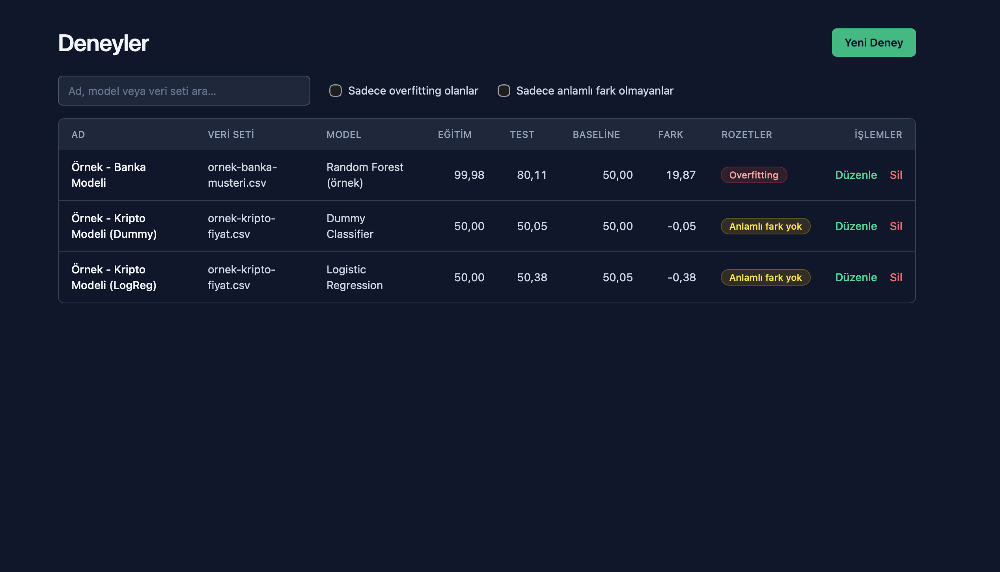

# ModelLedger

## Proje özeti

ModelLedger, tamamen tarayıcıda çalışan küçük bir makine öğrenmesi deney defteridir. MLflow veya Weights & Biases'ın hafif bir benzeri olarak düşünülebilir. Her deneyin veri setini, modelini, hiperparametrelerini ve eğitim/test/baseline skorlarını kaydeder. Sonuçları iki basit kurala göre otomatik olarak yorumlar. Backend yoktur; tüm veri tarayıcının `localStorage` alanında tutulur.

## Özellikler

### Deney yönetimi (CRUD)

- **Ekleme:** Ad, veri seti, model, dinamik anahtar/değer hiperparametre satırları ve üç skor (0–100 arası yüzde) girilir. Form Türkçe hata mesajlarıyla doğrulanır. Skorlarda hem `80.11` hem `80,11` yazımı kabul edilir.
- **Listeleme:** Tablo şu sütunları gösterir: Ad, Veri seti, Model, Eğitim, Test, Baseline, Fark (eğitim − test), Rozetler, İşlemler.
  - Sütun başlığına tıklayınca artan/azalan sıralama yapılır. Sayısal sütunlar sayı olarak sıralanır.
  - Ad, model ve veri setinde metin araması yapılabilir.
  - "Sadece overfitting olanlar" ve "Sadece anlamlı fark olmayanlar" filtreleri vardır.
- **Düzenleme:** Aynı form mevcut değerlerle dolu açılır. Kaydedince `id` ve `createdAt` değişmez, rozetler yeni değerlere göre yeniden hesaplanır.
- **Silme:** Onay modalı açılır. Escape tuşuyla kapatılabilir.
- **Kalıcılık:** Veri sayfa yenilendiğinde korunur. `localStorage` bozuksa uygulama çökmez, boş listeyle açılır. İlk açılışta örnek (demo) deneyler yüklenir.

### Akıllı kurallar

| Rozet | Koşul | Anlamı |
|---|---|---|
| 🟥 **Overfitting** | `eğitim − test > 10` | Model eğitim verisini ezberliyor, yeni veriye genelleyemiyor olabilir. |
| 🟨 **Anlamlı fark yok** | `test − baseline < 1` | Model, basit bir referans modelden belirgin şekilde daha iyi değil. |

Sınırlar kesindir. Tam 10 puanlık fark overfitting sayılmaz, tam 1 puanlık fark da uyarı almaz. Ondalıklı sayılarda JavaScript'in kayan nokta hataları (ör. `64.01 − 54.01 = 10.000000000000007`) yuvarlamayla giderilir. Bu sınır durumları birim testleriyle doğrulanır.

Rozetlerin anlamı yalnızca renkle verilmez, metinleri her zaman görünür. Rozetin üzerine gelince farkın kaç puan olduğu gösterilir.

## Teknolojiler

- **React 19** + **TypeScript 6**
- **Vite 8**: geliştirme sunucusu ve build
- **Tailwind CSS 4**: tek stil kaynağı
- **Vitest 5**: birim testleri
- **oxlint**: lint
- **localStorage**: veri saklama (backend yok)
- **Netlify**: SPA olarak yayın

## Klasör yapısı

```
src/
├── components/
│   ├── ConfirmDialog.tsx      # Silme onay modalı
│   ├── ExperimentForm.tsx     # Ekleme/düzenleme formu ve doğrulama
│   ├── ExperimentTable.tsx    # Tablo, sıralama başlıkları ve filtre alanı
│   └── InsightBadges.tsx      # Overfitting / Anlamlı fark yok rozetleri
├── data/
│   └── seed.ts                # İlk açılışta yüklenen örnek deneyler
├── hooks/
│   └── useExperiments.ts      # localStorage'a bağlı CRUD hook'u
├── interfaces/
│   └── Experiment.ts          # Experiment ve ExperimentInput tipleri
├── pages/
│   └── ExperimentsPage.tsx    # Sayfa; sıralama, filtre ve form state'i
├── utils/
│   ├── insights.ts            # Akıllı kurallar (saf fonksiyonlar)
│   └── insights.test.ts       # Sınır değer testleri
├── App.tsx
├── index.css
└── main.tsx
```

## Yerelde çalıştırma

Gereksinim: Node.js 20.19+ veya 22.12+.

```bash
git clone https://github.com/ccakirr/ModelLedger
cd ModelLedger
npm install
npm run dev
```

Tarayıcıda `http://localhost:5173` adresini aç.

Diğer komutlar:

| Komut | Açıklama |
|---|---|
| `npm run build` | Tip kontrolü yapar ve production build'i `dist/` klasörüne üretir |
| `npm run preview` | Build çıktısını yerelde sunar |
| `npm run test` | Birim testlerini çalıştırır |
| `npm run lint` | oxlint ile kod denetimi yapar |

Örnek verileri yeniden yüklemek için tarayıcının geliştirici araçlarında `localStorage` içindeki `modelledger:experiments` anahtarını silip sayfayı yenile.

## Canlı demo

https://joyful-churros-46e4cf.netlify.app

## Ekran görüntüsü



## Dürüst raporlama notu

Banka modeli eğitim verisinde %99,98, test verisinde ise %80,11 skor aldı. Aradaki ≈19,87 puanlık fark 10 puanlık eşiğin çok üstünde olduğu için model **Overfitting** olarak işaretlendi: model eğitim verisini büyük ölçüde ezberlemiş ve yeni veride aynı başarıyı gösterememiş. Kripto modelinde Logistic Regression testte %50,38 aldı; hiçbir şey öğrenmeyen Dummy Classifier baseline'ı ise %50,05 aldı. Aradaki 0,33 puanlık fark 1 puanlık eşiğin altında kaldığı için bu sonuç baseline'dan anlamlı derecede iyi sayılmadı; yani model, veriden öğrenmeyen bir referanstan pratikte ayırt edilemiyor.
